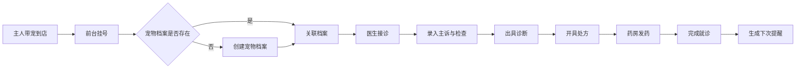

# 宠物诊所管理系统 - 产品需求文档

## 1. 产品概述
宠物诊所（兽医）管理系统，专为动物医疗场景设计。帮助诊所高效管理宠物档案、就诊记录、处方用药、住院护理、药品库存及运营数据，同时为宠物主人提供透明的医疗信息和实时关怀。

- **核心价值**：提升诊所运营效率，规范病历管理，增强宠物主人信任与满意度
- **目标用户**：兽医诊所（前台、医生、管理员）、宠物主人
- **市场定位**：中小规模宠物诊所的一体化管理解决方案

## 2. 核心功能

### 2.1 用户角色

| 角色 | 登录方式 | 核心权限 |
|------|----------|----------|
| 诊所管理员 | 账号密码登录 | 系统配置、用户管理、数据统计、药品库存管理 |
| 兽医 | 账号密码登录 | 宠物档案管理、就诊记录录入、处方开具、住院护理 |
| 前台 | 账号密码登录 | 挂号登记、预约管理、收费结算、客户沟通 |
| 宠物主人 | 手机号/验证码登录 | 查看宠物档案、就诊记录、用药说明、住院状态、疫苗提醒 |

### 2.2 功能模块

1. **首页仪表盘**：今日就诊概览、疫苗提醒、库存预警、月度数据统计
2. **宠物档案管理**：宠物信息登记、品种/年龄/体重/绝育状态、疫苗接种史、就诊历史
3. **就诊与病历管理**：挂号分诊、主诉记录、检查结果、诊断结论、处方开具
4. **疫苗与驱虫管理**：接种记录、到期自动提醒、下次预约、提醒通知
5. **处方药管理**：药品目录、处方开具、用药说明、用量记录
6. **住院护理管理**：住院登记、日常状态记录（饮食/精神/体温）、状态推送
7. **药品库存管理**：药品入库/出库、库存盘点、低库存预警、采购提醒
8. **数据统计分析**：月度病种统计、常用处方分析、复诊率统计、营收概览

### 2.3 页面详情

| 页面名称 | 模块名称 | 功能描述 |
|----------|----------|----------|
| 登录页 | 登录表单 | 账号密码登录、角色选择、记住登录状态 |
| 首页仪表盘 | 数据概览卡片 | 今日就诊数、待处理提醒、库存预警、本月营收 |
| 首页仪表盘 | 快捷操作区 | 快速挂号、新增宠物、药品入库 |
| 首页仪表盘 | 疫苗提醒列表 | 近期需接种疫苗的宠物列表及提醒状态 |
| 宠物列表页 | 筛选搜索栏 | 按品种、年龄、主人姓名搜索筛选 |
| 宠物列表页 | 宠物卡片列表 | 展示宠物头像、基本信息、最近就诊时间 |
| 宠物详情页 | 基础信息卡 | 品种、性别、年龄、体重、绝育状态、头像 |
| 宠物详情页 | 疫苗接种史 | 疫苗名称、接种日期、下次到期日、状态标签 |
| 宠物详情页 | 就诊记录时间线 | 按时间倒序展示所有就诊记录摘要 |
| 就诊记录页 | 病历详情 | 主诉、检查结果、诊断、处方详情 |
| 新增就诊页 | 病历录入表单 | 主诉、体格检查、辅助检查、诊断、治疗方案 |
| 处方开具页 | 药品选择 | 搜索药品、选择用量频次、用药说明 |
| 住院管理页 | 住院列表 | 在院宠物列表、入住时间、病房号 |
| 住院详情页 | 日常记录 | 每日饮食/精神/体温记录、时间线展示 |
| 住院详情页 | 主人通知 | 状态推送记录、主人已读状态 |
| 药品库存页 | 库存列表 | 药品名称、规格、库存数量、单位、预警阈值 |
| 药品库存页 | 入库操作 | 新增入库记录、供应商、批次、有效期 |
| 数据统计页 | 病种统计图表 | 月度各病种就诊量柱状图 |
| 数据统计页 | 处方统计 | 常用药品排行、处方金额分布 |
| 数据统计页 | 复诊率分析 | 各病种复诊率、医生复诊率 |
| 宠物主人端首页 | 我的宠物 | 宠物列表、健康概览、下次疫苗提醒 |
| 宠物主人端-就诊记录 | 历史就诊 | 就诊时间、诊断摘要、费用 |
| 宠物主人端-用药说明 | 处方详情 | 药品名称、用量、频次、用药天数、注意事项 |
| 宠物主人端-住院动态 | 住院实况 | 每日状态更新、实时推送 |

## 3. 核心流程

### 3.1 就诊流程
宠物主人带宠物到诊所 → 前台挂号并创建/关联宠物档案 → 医生接诊录入病历 → 开具检查/处方 → 药房发药 → 完成就诊 → 系统自动记录并生成下次疫苗/复诊提醒

### 3.2 住院护理流程
办理住院 → 分配病房 → 每日状态记录 → 状态推送给主人 → 出院结算

### 3.3 药品库存管理
药品入库登记 → 库存扣减（处方发药）→ 低库存预警 → 采购补充

## 4. 用户界面设计

### 4.1 设计风格
- **主色调**：温暖的翡翠绿（#10B981），传达健康、生命、关爱的品牌理念
- **辅助色**：柔和的天空蓝（#3B82F6），用于交互元素和信息提示
- **警示色**：珊瑚橙（#F97316）用于提醒和预警
- **中性色**：暖灰色系，营造温馨舒适的医疗氛围
- **按钮风格**：圆润圆角（8px），轻微悬浮阴影，点击反馈明显
- **卡片风格**：白色卡片配柔和阴影，边角圆润，信息层次清晰
- **字体**：标题使用现代无衬线字体，正文清晰易读，字号层级分明
- **布局**：左侧导航栏 + 顶部面包屑 + 主内容区的经典后台布局
- **图标风格**：线性图标，统一 2px 线条，配合色彩填充增强识别度

### 4.2 页面设计概览

| 页面名称 | 模块名称 | UI 元素 |
|----------|----------|---------|
| 登录页 | 品牌展示区 | Logo、品牌标语、暖色系渐变背景 |
| 登录页 | 登录表单 | 卡片式布局、输入框带图标、柔和阴影 |
| 首页仪表盘 | 数据卡片 | 彩色图标 + 数字 + 环比趋势、渐变背景 |
| 首页仪表盘 | 提醒列表 | 带状态标签的列表项、紧急程度颜色区分 |
| 宠物详情页 | 信息头部 | 大头像 + 基础信息网格 + 快速操作按钮 |
| 宠物详情页 | 时间线 | 竖线连接的就诊记录、图标标记就诊类型 |
| 病历录入页 | 表单分区 | 分组卡片、标签导航、保存草稿 |
| 住院详情页 | 状态时间线 | 每日记录卡片、体温折线图、饮食精神图标 |
| 药品库存页 | 库存表格 | 斑马纹、低库存红色高亮、操作列 |
| 数据统计页 | 图表区 | 彩色柱状图/折线图、图例清晰可交互 |

### 4.3 响应式设计
- **设计优先**：桌面端优先设计，保证管理后台操作效率
- **平板适配**：导航栏可折叠，内容区自适应宽度
- **宠物主人端**：独立的移动端优化界面，适合手机查看
- **触控优化**：按钮最小高度 44px，重要操作有足够点击区域

### 4.4 微交互与动效
- 页面切换时内容区淡入上滑
- 卡片悬停时轻微上浮和阴影加深
- 数据统计数字滚动动画
- 表单提交时的加载状态和成功反馈
- 提醒项的脉冲动画（紧急提醒）
- 时间线记录的错落出现动画
