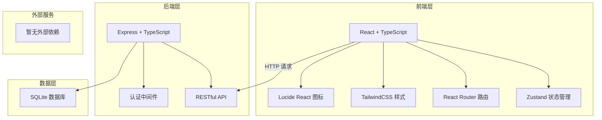
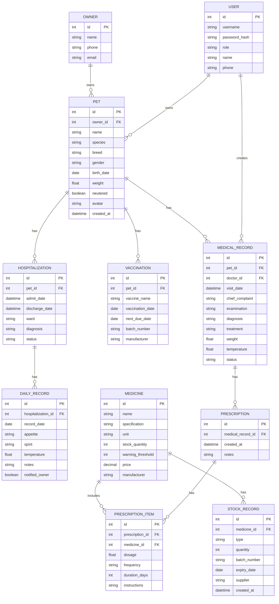

# 宠物诊所管理系统 - 技术架构文档

## 1. 架构设计



## 2. 技术选型说明

### 2.1 技术栈

| 层级 | 技术选型 | 版本 | 说明 |
|------|----------|------|------|
| 前端框架 | React | 18.x | 组件化开发，生态丰富 |
| 前端语言 | TypeScript | 5.x | 类型安全，提升代码质量 |
| 构建工具 | Vite | 5.x | 快速开发，热更新 |
| 样式方案 | TailwindCSS | 3.x | 原子化 CSS，快速开发 |
| 状态管理 | Zustand | 4.x | 轻量级状态管理，简单易用 |
| 路由管理 | React Router DOM | 6.x | 声明式路由 |
| 图标库 | Lucide React | 最新 | 简洁美观的线性图标 |
| 后端框架 | Express | 4.x | 轻量级 Node.js 框架 |
| 数据库 | SQLite | 3.x | 轻量级关系数据库，无需额外部署 |
| 数据库驱动 | better-sqlite3 | 最新 | 同步 SQLite 驱动，性能优秀 |

### 2.2 项目初始化方案
- 使用 `react-express-ts` 模板初始化项目
- 前后端分离架构，统一 TypeScript 全栈
- SQLite 作为本地数据库，文件存储，无需额外部署
- Mock 数据预置，开箱即用

## 3. 目录结构

```
项目根目录/
├── src/                      # 前端源代码
│   ├── components/           # 公共组件
│   │   ├── ui/              # 基础UI组件
│   │   ├── layout/           # 布局组件
│   │   └── common/          # 业务组件
│   ├── pages/                # 页面组件
│   │   ├── dashboard/      # 首页仪表盘
│   │   ├── pets/            # 宠物管理
│   │   ├── medical/         # 就诊病历
│   │   ├── vaccine/         # 疫苗管理
│   │   ├── hospitalization/ # 住院管理
│   │   ├── pharmacy/        # 药品库存
│   │   ├── statistics/      # 数据统计
│   │   └── auth/            # 登录认证
│   │   └── owner/           # 宠物主人端
│   ├── hooks/                # 自定义 Hooks
│   ├── store/                # Zustand 状态
│   ├── utils/                # 工具函数
│   ├── types/                # TypeScript 类型定义
│   ├── assets/               # 静态资源
│   ├── App.tsx
│   └── main.tsx
├── api/                      # 后端源代码
│   ├── routes/               # 路由层
│   ├── controllers/          # 控制层
│   ├── services/             # 服务层
│   ├── models/               # 数据模型
│   ├── middleware/           # 中间件
│   ├── utils/                # 工具函数
│   ├── types/                # 类型定义
│   └── index.ts              # 入口文件
├── shared/                   # 前后端共享类型
├── database/                 # 数据库相关
│   ├── schema.sql            # 建表语句
│   └── seed.sql              # 种子数据
├── public/                   # 前端静态资源
├── vite.config.ts
├── tailwind.config.js
├── tsconfig.json
└── package.json
```

## 4. 路由定义

### 4.1 前端路由

| 路由路径 | 页面名称 | 说明 |
|----------|----------|------|
| /login | 登录页 | 诊所工作人员登录 |
| / | 首页仪表盘 | 数据概览、快捷操作、提醒 |
| /pets | 宠物列表 | 宠物档案列表、搜索筛选 |
| /pets/:id | 宠物详情 | 宠物基本信息、疫苗史、就诊记录 |
| /pets/new | 新增宠物 | 创建宠物档案 |
| /medical | 就诊列表 | 今日就诊、历史就诊 |
| /medical/new | 新增就诊 | 病历录入、处方开具 |
| /medical/:id | 就诊详情 | 病历详情查看 |
| /vaccine | 疫苗管理 | 疫苗接种记录、提醒列表 |
| /hospitalization | 住院管理 | 在院宠物列表 |
| /hospitalization/:id | 住院详情 | 住院记录、日常状态 |
| /pharmacy | 药品库存 | 库存列表、入库出库 |
| /pharmacy/new | 药品入库 | 新增药品入库 |
| /statistics | 数据统计 | 病种、处方、复诊率统计 |
| /owner/login | 主人端登录 | 宠物主人登录入口 |
| /owner/home | 主人端首页 | 我的宠物、健康概览 |
| /owner/pets/:id | 主人端宠物详情 | 宠物信息、就诊记录 |
| /owner/medical/:id | 主人端就诊详情 | 病历、用药说明 |
| /owner/hospital/:id | 主人端住院动态 | 住院状态更新 |

### 4.2 后端 API 路由

| 方法 | 路径 | 说明 |
|------|------|------|
| POST | /api/auth/login | 登录 |
| GET | /api/auth/owner-login | 宠物主人登录 |
| GET | /api/pets | 获取宠物列表 |
| GET | /api/pets/:id | 获取宠物详情 |
| POST | /api/pets | 创建宠物档案 |
| PUT | /api/pets/:id | 更新宠物信息 |
| GET | /api/pets/:id/medical-records | 获取宠物就诊记录 |
| POST | /api/medical-records | 创建就诊记录 |
| GET | /api/medical-records/:id | 获取就诊详情 |
| PUT | /api/medical-records/:id | 更新就诊记录 |
| GET | /api/medical-records | 获取就诊列表 |
| GET | /api/vaccinations | 获取疫苗记录列表 |
| POST | /api/vaccinations | 添加疫苗接种记录 |
| GET | /api/vaccinations/reminders | 获取疫苗提醒 |
| GET | /api/hospitalizations | 获取住院列表 |
| POST | /api/hospitalizations | 创建住院记录 |
| GET | /api/hospitalizations/:id | 获取住院详情 |
| POST | /api/hospitalizations/:id/daily-records | 添加住院日常记录 |
| GET | /api/medicines | 获取药品列表 |
| POST | /api/medicines | 新增药品 |
| PUT | /api/medicines/:id | 更新药品信息 |
| POST | /api/medicines/:id/stock-in | 药品入库 |
| POST | /api/medicines/low-stock | 获取低库存药品 |
| GET | /api/prescriptions | 获取处方列表 |
| POST | /api/prescriptions | 创建处方 |
| GET | /api/statistics/dashboard | 仪表盘统计数据 |
| GET | /api/statistics/diseases | 病种统计 |
| GET | /api/statistics/prescriptions | 处方统计 |
| GET | /api/statistics/revisit-rate | 复诊率统计 |
| GET | /api/owners/pets | 主人获取自己的宠物列表 |

## 5. 数据模型设计

### 5.1 ER 图



### 5.2 核心表说明

| 表名 | 说明 | 关键字段 |
|------|------|----------|
| users | 诊所用户表 | 用户名、密码哈希、角色、姓名、电话 |
| owners | 宠物主人表 | 姓名、电话、邮箱 |
| pets | 宠物档案表 | 主人ID、名字、物种、品种、性别、出生日期、体重、绝育状态 |
| vaccinations | 疫苗接种表 | 宠物ID、疫苗名称、接种日期、下次到期日 |
| medical_records | 就诊记录表 | 宠物ID、医生ID、就诊时间、主诉、检查、诊断、治疗 |
| prescriptions | 处方表 | 就诊记录ID、创建时间、备注 |
| prescription_items | 处方明细表 | 处方ID、药品ID、用量、频次、天数 |
| medicines | 药品表 | 名称、规格、单位、库存数量、预警阈值、价格 |
| stock_records | 库存记录表 | 药品ID、类型(入库/出库)、数量、批次、有效期 |
| hospitalizations | 住院记录表 | 宠物ID、入院时间、出院时间、病房、状态 |
| daily_records | 住院日常表 | 住院ID、日期、饮食、精神、体温、是否通知主人 |

## 6. 状态管理设计

使用 Zustand 进行状态管理，按模块划分：

### 6.1 Auth Store
- 当前登录用户信息
- 登录状态
- 登录/登出方法

### 6.2 Pet Store
- 宠物列表
- 当前选中宠物
- 搜索筛选条件
- 加载状态

### 6.3 Medical Store
- 就诊记录列表
- 当前就诊详情
- 处方信息

### 6.4 Medicine Store
- 药品列表
- 库存预警列表

## 7. 认证与权限

### 7.1 认证方式
- JWT Token 认证
- Token 存储在 localStorage
- 请求时携带 Authorization header
- Token 过期自动刷新

### 7.2 权限控制
- 路由级权限：根据角色判断是否可访问页面
- 按钮级权限：根据角色控制操作按钮显示
- 后端中间件：API 接口权限校验

## 8. 开发规范

### 8.1 代码规范
- TypeScript 严格模式
- ESLint 代码检查
- 组件命名：PascalCase
- 函数命名：camelCase
- 常量命名：UPPER_SNAKE_CASE

### 8.2 组件规范
- 单一职责原则
- 组件文件不超过 300 行
- 优先使用函数式组件 + Hooks
- Props 使用 TypeScript 接口定义
